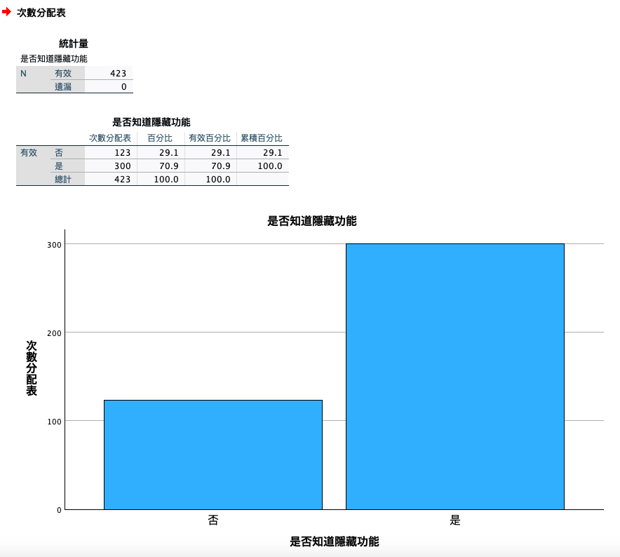

# 是否知道隱藏功能

<br>

## 說明

1. 開啟指定的資料集。

   ```bash
   *========================================.
   DATASET ACTIVATE 資料集1.
   *========================================.
   ```

<br>

2. 簡易重新編碼 `isKnowHideFunction`。

   ```bash
   *========================================.
   *重新編碼為不同變數：是否知道隱藏.

   *重新編碼為不同變數，若編碼為相同變數則不要加上 INTO 即可.
   RECODE 請問您是否知道Instagram有「隱藏此貼文的按讚數 ('是'=1) ('否'=0)  INTO isKnowHideFunction.

   *小數的位數為「0」，F 為 Format 的意思.
   FORMATS isKnowHideFunction(F1.0).

   *變數類型為名義.
   VARIABLE LEVEL isKnowHideFunction(NOMINAL).

   *執行.
   EXECUTE.
   *========================================.
   ```

<br>

3. 標籤、值標籤、小數位數、變數類型。

   ```bash
   *========================================.
   *標籤名稱.
   VARIABLE LABELS isKnowHideFunction '是否知道隱藏功能'.

   *小數的位數為「0」，F 為 Format 的意思.
   FORMATS isKnowHideFunction (F1.0).

   *變數類型為名義.
   VARIABLE LEVEL isKnowHideFunction (NOMINAL).

   *靠左 置中 靠右 LEFT CENTER RIGHT.
   VARIABLE ALIGN isKnowHideFunction (CENTER).

   *值標籤.
   VALUE LABELS isKnowHideFunction
   0 '否'
   1 '是'
   2 ELSE

   *執行.
   EXECUTE.
   *========================================.
   ```

<br>

## 繪圖

1. 次數分配＋繪圖。

   ```bash
   *========================================.
   *次數分配＋繪圖：是否知道功能.
   FREQUENCIES VARIABLES=isKnowHideFunction
   /BARCHART FREQ
   /ORDER=ANALYSIS.
   *========================================.
   ```

<br>

2. 結果。

   

<br>

## 刪除

1. 將原有變數刪除。

   ```bash
   *========================================.
   *刪除原有變數.
   DELETE VARIABLES 請問您是否知道Instagram有「隱藏此貼文的按讚數.
   *========================================.
   ```

<br>

---

_END_
