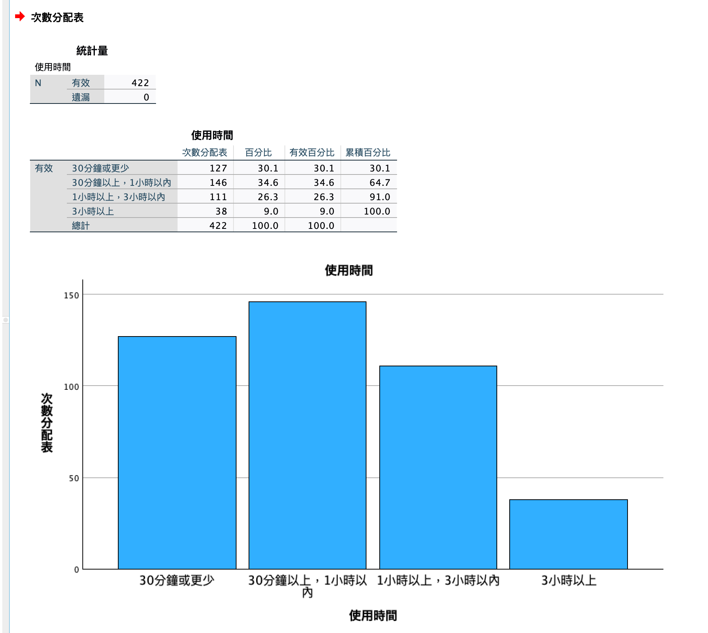

# 每日使用時數 

<br>

## 說明

1. 開啟指定的資料集。

    ```bash
    *========================================.
    DATASET ACTIVATE 資料集1.
    *========================================.
    ```

<br>

2. 簡易重新編碼 `useTime`。

    ```bash
    *========================================.
    *重新編碼為不同變數：使用時數 useTime.

    *重新編碼為不同變數，若編碼為相同變數則不要加上 INTO 即可.
    RECODE 無論是透過手機、平板還是電腦等裝置，請問您 
    ('30分鐘或更少'=1)
    ('30分鐘以上，1小時以內'=2) 
    ('1小時以上，3小時以內'=3) 
    ('3小時以上'=4)
    (ELSE=5) 
    INTO useTime.

    *標籤名稱.
    VARIABLE LABELS  useTime '使用時數'.

    *小數的位數為「0」，F 為 Format 的意思.
    FORMATS useTime (F1.0).

    *變數類型為序數.
    VARIABLE LEVEL useTime (ORDINAL).

    *執行.
    EXECUTE.
    *========================================.
    ```

<br>

3. 標籤、值標籤、小數位數、變數類型。

    ```bash
    *========================================.
    *標籤名稱.
    VARIABLE LABELS useTime '使用時間'.

    *小數的位數為「0」，F 為 Format 的意思.
    FORMATS useTime (F1.0).

    *變數類型為序數.
    VARIABLE LEVEL useTime (ORDINAL).

    *靠左 置中 靠右 LEFT CENTER RIGHT.
    VARIABLE ALIGN useTime (CENTER).

    *值標籤.
    VALUE LABELS useTime
    1 '30分鐘或更少'
    2 '30分鐘以上，1小時以內'
    3 '1小時以上，3小時以內'
    4 '3小時以上'
    5 ELSE
    .

    *執行.
    EXECUTE.
    *========================================.
    ```

<br>

## 繪圖

1. 次數分配＋繪圖。

    ```bash
    *========================================.
    *次數分配＋繪圖：使用頻率.
    FREQUENCIES VARIABLES=useTime
    /BARCHART FREQ
    /ORDER=ANALYSIS.
    *========================================.
    ```

<br>

2. 結果。

    

<br>

## 刪除

1. 刪除原有變數。 

    ```bash
    *========================================.
    *刪除原有變數.
    DELETE VARIABLES 無論是透過手機、平板還是電腦等裝置，請問您.
    *========================================.
    ```

<br>

___

_END_
