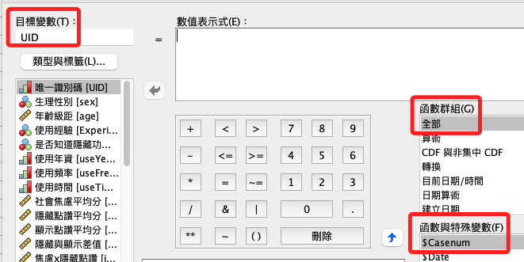
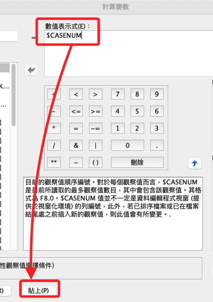
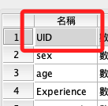

# 添加 UID

_因為後續步驟會使用到重複測量混合模型，該統計方法需要樣本具備唯一識別符，後續會再作說明。_

<br>

## 面板操作

_先示範在面板中如何操作_

<br>

1. 開啟 `轉換 -> 計算變數`。

    

<br>

2. 輸入名稱 `UID`， 函數群組選擇 `全部`，下方第一個預設的計算公式為 `$CASENUM`，點擊。

    

<br>

3. 點擊兩下就會自動將函數添加到 `數值表示式` 的對話中，然後點擊 `貼上` 可查看語法，點擊 `確認` 就會添加 UID。

    

<br>

## 準備工作

1. 開啟指定的資料集。

    ```bash
    *========================================.
    DATASET ACTIVATE 資料集1.
    *========================================.
    ```

<br>

## 語法操作

1. 添加 UID。

    ```bash
    *========================================.
    *添加 UID.
    COMPUTE UID = $CASENUM.
    EXECUTE.
    *========================================.
    ```

<br>

2. 標籤、值標籤、小數位數、變數類型。

    ```bash
    *========================================.
    *標籤名稱.
    VARIABLE LABELS UID '唯一識別碼'.

    *小數的位數為「0」，F 為 Format 的意思.
    FORMATS UID (F4.0).

    *變數類型為序數.
    VARIABLE LEVEL UID (ORDINAL).

    *靠左 置中 靠右 LEFT CENTER RIGHT.
    VARIABLE ALIGN UID (CENTER).

    *執行.
    EXECUTE.
    *========================================.
    ```

<br>

3. 接下來要把 UID 移動到最前面。

    

<br>

4. 重新完整排序；可手動進行編輯，斷行與縮排無強規定。

    ```bash
    *========================================.
    *排序變數.
    MATCH FILES FILE = *
    /KEEP = UID sex age isKnowHideFunction useYears useFrequency useTime
    Ｑan01 Ｑan02 Ｑan03 Ｑan04 Ｑan05 Ｑan06 Ｑan07 Ｑan08 
    Ｑan09 Ｑan10 Ｑan11 Ｑan12 Ｑan13 Ｑan14 Ｑan15 Ｑan16 
    Ｑan17 Ｑan18 Ｑan19
    Hide01 Hide02 Hide03 Hide04 Hide05 Hide06 Hide07
    Hide08 Hide09 Hide10 Hide11 Hide12 Hide13 Hide14 
    Hide15 Hide16 Hide17 Hide18
    Show01 Show02 Show03 Show04 Show05 Show06 Show07
    Show08 Show09 Show10 Show11 Show12 Show13 Show14
    Show15 Show16 Show17 Show18.
    EXECUTE.
    *========================================.
    ```

<br>

## 存檔

<br>

1. 儲存數據。

    ```bash
    *==============================.
    *儲存檔案.
    SAVE OUTFILE='/Users/samhsiao/Desktop/00_論文實作/v01_09_建立UID完成.sav'.
    *==============================.
    ```

<br>

___

_END_
