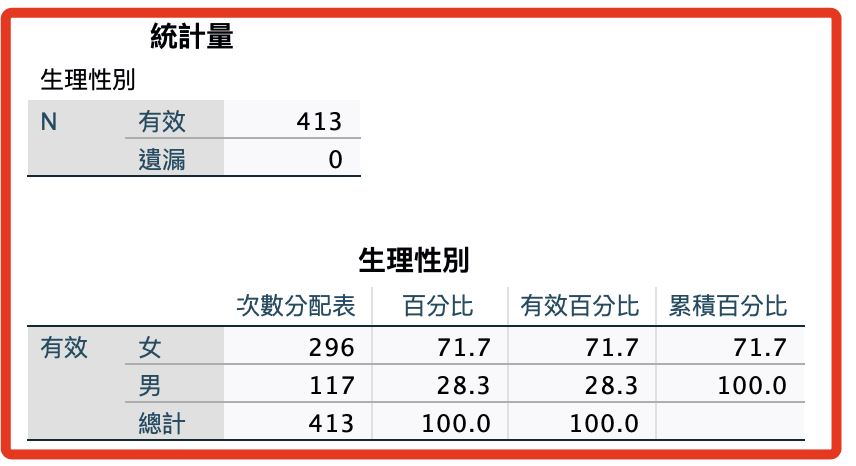

# 第一階段

_不同樣本的答案全部一樣，這是一定要刪除的_

<br>

## 操作步驟說明

1. 資料 -> 識別重複觀察值

    

<br>

2. 選取時，除了必然不一致的 `UID` 外全部加入，包含使用 `計算變數` 所新增的變數在內，全部變數都加入。

    

<br>

3. 設定 `排序` 使用升冪或降冪皆可。

    

<br>

4. 各項設定值都使用預設即可；因為這階段比較了全部的內容，所以保留第一個或最後一個並無差異。

    

<br>

5. 記得先選擇 `貼上` 來取得語法，這樣便於 `重複操作`。

    

<br>

## 語法與輸出紀錄

1. 識別重複觀察值：全部一樣。

    ```bash
    *========================================.
    * 識別重複觀察值.
    SORT CASES BY sex(A) age(A) isKnowHideFunction(A) useYears(A) useFrequency(A) useTime(A) Ｑan01(A) 
        Ｑan02(A) Ｑan03(A) Ｑan04(A) Ｑan05(A) Ｑan06(A) Ｑan07(A) Ｑan08(A) Ｑan09(A) Ｑan10(A) Ｑan11(A) Ｑan12(A) 
        Ｑan13(A) Ｑan14(A) Ｑan15(A) Ｑan16(A) Ｑan17(A) Ｑan18(A) Ｑan19(A) Hide01(A) Hide02(A) Hide03(A) 
        Hide04(A) Hide05(A) Hide06(A) Hide07(A) Hide08(A) Hide09(A) Hide10(A) Hide11(A) Hide12(A) Hide13(A) 
        Hide14(A) Hide15(A) Hide16(A) Hide17(A) Hide18(A) Show01(A) Show02(A) Show03(A) Show04(A) Show05(A) 
        Show06(A) Show07(A) Show08(A) Show09(A) Show10(A) Show11(A) Show12(A) Show13(A) Show14(A) Show15(A) 
        Show16(A) Show17(A) Show18(A) UID(A).
    MATCH FILES
    /FILE=*
    /BY sex age isKnowHideFunction useYears useFrequency useTime Ｑan01 Ｑan02 Ｑan03 Ｑan04 Ｑan05 Ｑan06 
        Ｑan07 Ｑan08 Ｑan09 Ｑan10 Ｑan11 Ｑan12 Ｑan13 Ｑan14 Ｑan15 Ｑan16 Ｑan17 Ｑan18 Ｑan19 Hide01 Hide02 Hide03 
        Hide04 Hide05 Hide06 Hide07 Hide08 Hide09 Hide10 Hide11 Hide12 Hide13 Hide14 Hide15 Hide16 Hide17 
        Hide18 Show01 Show02 Show03 Show04 Show05 Show06 Show07 Show08 Show09 Show10 Show11 Show12 Show13 
        Show14 Show15 Show16 Show17 Show18
    /FIRST=PrimaryFirst
    /LAST=PrimaryLast.
    DO IF (PrimaryFirst).
    COMPUTE  MatchSequence=1-PrimaryLast.
    ELSE.
    COMPUTE  MatchSequence=MatchSequence+1.
    END IF.
    LEAVE  MatchSequence.
    FORMATS  MatchSequence (f7).
    COMPUTE  InDupGrp=MatchSequence>0.
    SORT CASES InDupGrp(D).
    MATCH FILES
    /FILE=*
    /DROP=PrimaryFirst InDupGrp MatchSequence.
    VARIABLE LABELS  PrimaryLast '將所有最後一個相符觀察值標為「主要」指標'.
    VALUE LABELS  PrimaryLast 0 '重複觀察值' 1 '主要觀察值'.
    VARIABLE LEVEL  PrimaryLast (ORDINAL).
    FREQUENCIES VARIABLES=PrimaryLast.
    EXECUTE.
    *========================================.
    ```

<br>

2. 結果。

    

<br>

## 處理

1. 刪除異常樣本。

    ```bash
    *========================================.
    *刪除 PrimaryLast 為 0 的觀察值.
    SELECT IF (PrimaryLast = 1).
    EXECUTE.
    *========================================.
    ```

<br>

2. 刪除變數。

    ```bash
    *========================================.
    *刪除題目：變數.
    DELETE VARIABLES PrimaryLast.
    EXECUTE.
    *========================================.
    ```

<br>

3. 重新按照 UID 排序。

    ```bash
    *========================================.
    *排序.
    SORT CASES BY UID (A).
    EXECUTE.
    *========================================.
    ```

<br>

4. 存檔。

    ```bash
    *========================================.
    *儲存檔案.
    SAVE OUTFILE='/Users/samhsiao/Desktop/00_論文實作/v1_06_識別重複觀察值01.sav'
    .
    *========================================.
    ```

<br>

5. 觀察：當前項本數（以性別）。

    ```bash
    *========================================.
    *次數分配：sex.
    FREQUENCIES VARIABLES=sex
    /ORDER=ANALYSIS.
    *========================================.
    ```

<br>

6. 結果：刪除（9）個重複觀察值。

    

<br>

___

_END_

---END---
