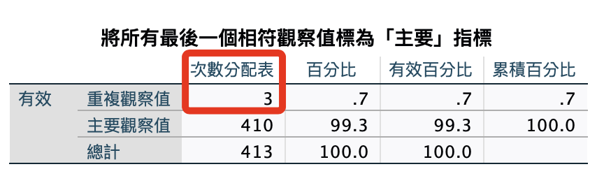
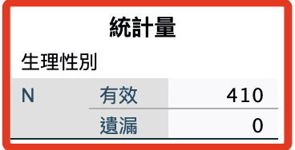

# 第二階段

_檢查 `基本資料` ＋ `隱藏` 的部分答案一致的樣本_

<br>

## 操作記錄

1. 識別重複觀察值：基本＋隱藏。

    ```bash
    *========================================.
    * 識別重複觀察值.
    SORT CASES BY sex(A) age(A) isKnowHideFunction(A) useYears(A) useFrequency(A) useTime(A) Hide01(A) 
        Hide02(A) Hide03(A) Hide04(A) Hide05(A) Hide06(A) Hide07(A) Hide08(A) Hide09(A) Hide10(A) Hide11(A) 
        Hide12(A) Hide13(A) Hide14(A) Hide15(A) Hide16(A) Hide17(A) Hide18(A).
    MATCH FILES
    /FILE=*
    /BY sex age isKnowHideFunction useYears useFrequency useTime Hide01 Hide02 Hide03 Hide04 Hide05 
        Hide06 Hide07 Hide08 Hide09 Hide10 Hide11 Hide12 Hide13 Hide14 Hide15 Hide16 Hide17 Hide18
    /FIRST=PrimaryFirst
    /LAST=PrimaryLast.
    DO IF (PrimaryFirst).
    COMPUTE  MatchSequence=1-PrimaryLast.
    ELSE.
    COMPUTE  MatchSequence=MatchSequence+1.
    END IF.
    LEAVE  MatchSequence.
    FORMATS  MatchSequence (f7).
    COMPUTE  InDupGrp=MatchSequence>0.
    SORT CASES InDupGrp(D).
    MATCH FILES
    /FILE=*
    /DROP=PrimaryFirst InDupGrp MatchSequence.
    VARIABLE LABELS  PrimaryLast '將所有最後一個相符觀察值標為「主要」指標'.
    VALUE LABELS  PrimaryLast 0 '重複觀察值' 1 '主要觀察值'.
    VARIABLE LEVEL  PrimaryLast (ORDINAL).
    FREQUENCIES VARIABLES=PrimaryLast.
    EXECUTE.
    *========================================.
    ```

<br>

2. 結果。

    

<br>

3. 刪除異常樣本。

    ```bash
    *========================================.
    *刪除 PrimaryLast 為 0 的觀察值.
    SELECT IF (PrimaryLast = 1).
    EXECUTE.

    *刪除題目：變數.
    DELETE VARIABLES PrimaryLast.
    EXECUTE.

    *排序：按照 UID 排序.
    SORT CASES BY UID (A).
    EXECUTE.
    *========================================.
    ```

<br>

4. 存檔。

    ```bash
    *========================================.
    *儲存檔案.
    SAVE OUTFILE='/Users/samhsiao/Desktop/02_論文_清心/00_論文數據/v6_04_識別重複觀察值02.sav'.
    *========================================.

    「觀察：當前項本數（以性別）」
    *========================================.
    *性別.
    FREQUENCIES VARIABLES=sex
    /ORDER=ANALYSIS.
    *========================================.
    ```

<br>

5. 結果（410）。

    

<br>

___

_END_