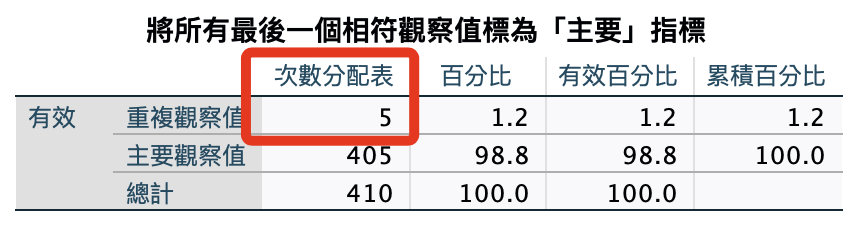
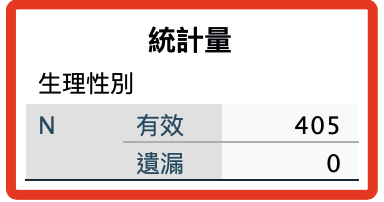

# 第三階段

_檢查 `基本資料` ＋ `顯示` 的部分答案一致的樣本_

<br>

## 操作記錄

1. 識別重複觀察值：基本＋顯示。

    ```bash
    *========================================.
    * 識別重複觀察值.
    SORT CASES BY sex(A) age(A) isKnowHideFunction(A) useYears(A) useFrequency(A) useTime(A) Show01(A) 
        Show02(A) Show03(A) Show04(A) Show05(A) Show06(A) Show07(A) Show08(A) Show09(A) Show10(A) Show11(A) 
        Show12(A) Show13(A) Show14(A) Show15(A) Show16(A) Show17(A) Show18(A).
    MATCH FILES
    /FILE=*
    /BY sex age isKnowHideFunction useYears useFrequency useTime Show01 Show02 Show03 Show04 Show05 
        Show06 Show07 Show08 Show09 Show10 Show11 Show12 Show13 Show14 Show15 Show16 Show17 Show18
    /FIRST=PrimaryFirst
    /LAST=PrimaryLast.
    DO IF (PrimaryFirst).
    COMPUTE  MatchSequence=1-PrimaryLast.
    ELSE.
    COMPUTE  MatchSequence=MatchSequence+1.
    END IF.
    LEAVE  MatchSequence.
    FORMATS  MatchSequence (f7).
    COMPUTE  InDupGrp=MatchSequence>0.
    SORT CASES InDupGrp(D).
    MATCH FILES
    /FILE=*
    /DROP=PrimaryFirst InDupGrp MatchSequence.
    VARIABLE LABELS  PrimaryLast '將所有最後一個相符觀察值標為「主要」指標'.
    VALUE LABELS  PrimaryLast 0 '重複觀察值' 1 '主要觀察值'.
    VARIABLE LEVEL  PrimaryLast (ORDINAL).
    FREQUENCIES VARIABLES=PrimaryLast.
    EXECUTE.
    *========================================.
    ```

<br>

2. 結果有（5）個。

    

<br>

3. 刪除異常樣本。

    ```bash
    *========================================.
    *刪除 PrimaryLast 為 0 的觀察值.
    SELECT IF (PrimaryLast = 1).
    EXECUTE.

    *刪除題目：變數.
    DELETE VARIABLES PrimaryLast.
    EXECUTE.

    *排序.
    SORT CASES BY UID (A).
    EXECUTE.
    *========================================.
    ```

<br>

4. 存檔。

    ```bash
    *========================================.
    *儲存檔案.
    SAVE OUTFILE='/Users/samhsiao/Desktop/02_論文_清心/00_論文數據/v6_04_識別重複觀察值03.sav'.
    *========================================.
    ```

<br>

5. 觀察：當前項本數（以性別）。

    ```bash
    *========================================.
    *性別.
    FREQUENCIES VARIABLES=sex
    /ORDER=ANALYSIS.
    *========================================.
    ```

<br>

6. 結果（405）。

    

<br>

___

_END_
