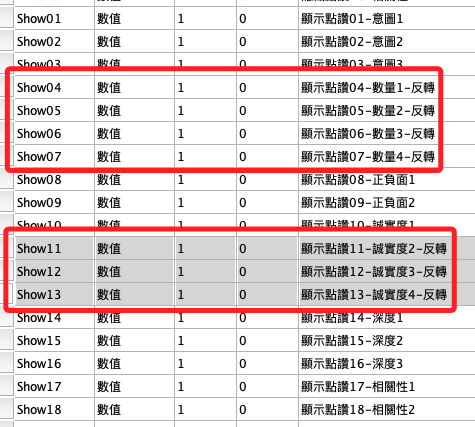

# 反轉

_分析之前先處理反向題_

<br>

## 反向題

_在本實驗問卷中的反轉提包含以下三部分_

<br>

1. 社會焦慮的第 08、10 兩題；

2. 顯示跟隱藏的第二個構面第（4、5、6、7）題；

3. 顯示跟隱藏的第四個構面第（11、12、13）題。

<br>

## 說明

1. 透過 `重新編碼` 為 `不同變數` 或 `相同變數` 進行校正。

2. 操作過程中會先對原始的變數進行更名，主要用意是確認在語法中能正確捕捉數據，再將更名後的變數複製一份進行處理，是基於對原始數據的保護，所有的操作會在複本上進行，確認無誤後再將原始數據刪除，並將複本更名為原始名稱；這樣的透過中間變數進行數據交換的機制，在編程與資料處理中很常被使用。

3. 中間變數與分階段階段進行有利於資料的保護與結果的驗證，避免各種可能的錯誤與有利於復原的進行；特別強調，數據的處理過程要環環相扣，切不可躁進出錯而扭曲了原始數據，數據的人為誤植與數據造假並無本質是差異。

<br>

## 開啟正確的資料集

1. 開啟指定的資料集如 `資料集1`。

    ```bash
    *========================================.
    DATASET ACTIVATE 資料集1.
    *========================================.
    ```

<br>

## 操作記錄

_以下先將要反轉的變數進行更名，基於謹慎考量，儘可能分階段操作；特別說明，這不是必要程序，僅出於避免出錯的目的。_

<br>

1. 對象。

    ```bash
    Ｑan08、Ｑan10
    Hide04、Hide05、Hide06、Hide07、Hide11、Hide12、Hide13
    Show04、Show05、Show06、Show07、Show11、Show12、Show13
    ```

<br>

2. 第一步：變更名稱，將原本的名稱添加尾綴 `_old`，這個步驟除了更名以外，還可觀察是否確實捕捉原始數據，若過程中未被正確更名者，代表其變數命名可能出錯，特別留意。

    ```bash
    *========================================.
    *變數更名.
    RENAME VARIABLES
    (Ｑan08 = Ｑan08_old) (Ｑan10 = Ｑan10_old)
    (Hide04 = Hide04_old) (Hide05 = Hide05_old)
    (Hide06 = Hide06_old) (Hide07 = Hide07_old)
    (Hide11 = Hide11_old) (Hide12 = Hide12_old) (Hide13 = Hide13_old)
    (Show04 = Show04_old) (Show05 = Show05_old)
    (Show06 = Show06_old) (Show07 = Show07_old)
    (Show11 = Show11_old) (Show12 = Show12_old) (Show13 = Show13_old).

    *執行.
    EXECUTE.
    *========================================.
    ```

<br>

3. `反向題反轉` 並 `建立新的變數名稱`；順利完成更名者代表都已被正確捕捉，對其進行反轉並建立新的名稱，特別注意，這步驟保留了原始變數，。

    ```bash
    *========================================.
    *反轉且建立新的變數名稱.
    RECODE Ｑan08_old (1=5) (2=4) (3=3) (4=2) (5=1) INTO Ｑan08_R.
    RECODE Ｑan10_old (1=5) (2=4) (3=3) (4=2) (5=1) INTO Ｑan10_R.
    RECODE Hide04_old (1=5) (2=4) (3=3) (4=2) (5=1) INTO Hide04_R.
    RECODE Hide05_old (1=5) (2=4) (3=3) (4=2) (5=1) INTO Hide05_R.
    RECODE Hide06_old (1=5) (2=4) (3=3) (4=2) (5=1) INTO Hide06_R.
    RECODE Hide07_old (1=5) (2=4) (3=3) (4=2) (5=1) INTO Hide07_R.
    RECODE Hide11_old (1=5) (2=4) (3=3) (4=2) (5=1) INTO Hide11_R.
    RECODE Hide12_old (1=5) (2=4) (3=3) (4=2) (5=1) INTO Hide12_R.
    RECODE Hide13_old (1=5) (2=4) (3=3) (4=2) (5=1) INTO Hide13_R.
    RECODE Show04_old (1=5) (2=4) (3=3) (4=2) (5=1) INTO Show04_R.
    RECODE Show05_old (1=5) (2=4) (3=3) (4=2) (5=1) INTO Show05_R.
    RECODE Show06_old (1=5) (2=4) (3=3) (4=2) (5=1) INTO Show06_R.
    RECODE Show07_old (1=5) (2=4) (3=3) (4=2) (5=1) INTO Show07_R.
    RECODE Show11_old (1=5) (2=4) (3=3) (4=2) (5=1) INTO Show11_R.
    RECODE Show12_old (1=5) (2=4) (3=3) (4=2) (5=1) INTO Show12_R.
    RECODE Show13_old (1=5) (2=4) (3=3) (4=2) (5=1) INTO Show13_R.

    *執行.
    EXECUTE.
    *========================================.
    ```

<br>

4. 標籤、值標籤、小數位數、變數類型。

    ```bash
    *========================================.
    *標籤名稱.
    VARIABLE LABELS Ｑan08_R '社會焦慮08反轉'.
    VARIABLE LABELS Ｑan10_R '社會焦慮10反轉'.
    VARIABLE LABELS Hide04_R '隱藏點讚04-數量1-反轉'.
    VARIABLE LABELS Hide05_R '隱藏點讚05-數量2-反轉'.
    VARIABLE LABELS Hide06_R '隱藏點讚06-數量3-反轉'.
    VARIABLE LABELS Hide07_R '隱藏點讚07-數量4-反轉'.
    VARIABLE LABELS Hide11_R '隱藏點讚11-誠實度2-反轉'.
    VARIABLE LABELS Hide12_R '隱藏點讚12-誠實度3-反轉'.
    VARIABLE LABELS Hide13_R '隱藏點讚13-誠實度4-反轉'.
    VARIABLE LABELS Show04_R '顯示點讚04-數量1-反轉'.
    VARIABLE LABELS Show05_R '顯示點讚05-數量2-反轉'.
    VARIABLE LABELS Show06_R '顯示點讚06-數量3-反轉'.
    VARIABLE LABELS Show07_R '顯示點讚07-數量4-反轉'.
    VARIABLE LABELS Show11_R '顯示點讚11-誠實度2-反轉'.
    VARIABLE LABELS Show12_R '顯示點讚12-誠實度3-反轉'.
    VARIABLE LABELS Show13_R '顯示點讚13-誠實度4-反轉'.

    *小數的位數為「0」，F 為 Format 的意思.
    FORMATS Ｑan08_R (F1.0).
    FORMATS Ｑan10_R (F1.0).
    FORMATS Hide04_R TO Hide07_R (F1.0).
    FORMATS Hide11_R TO Hide13_R (F1.0).
    FORMATS Show04_R TO Show07_R (F1.0).
    FORMATS Show11_R TO Show13_R (F1.0).

    *變數類型為序數.
    VARIABLE LEVEL Ｑan08_R Ｑan10_R (ORDINAL).
    VARIABLE LEVEL Hide04_R TO Hide07_R (ORDINAL).
    VARIABLE LEVEL Hide11_R TO Hide13_R (ORDINAL).
    VARIABLE LEVEL Show04_R TO Show07_R (ORDINAL).
    VARIABLE LEVEL Show11_R TO Show13_R (ORDINAL).

    *置中 CENTER.
    VARIABLE ALIGN Ｑan08_R Ｑan10_R (CENTER).
    VARIABLE ALIGN Hide04_R TO Hide07_R (CENTER).
    VARIABLE ALIGN Hide11_R TO Hide13_R (CENTER).
    VARIABLE ALIGN Show04_R TO Show07_R (CENTER).
    VARIABLE ALIGN Show11_R TO Show13_R (CENTER).

    *值標籤.
    VALUE LABELS 
    Ｑan08_R Ｑan10_R 
    Hide04_R TO Hide07_R 
    Hide11_R TO Hide13_R 
    Show04_R TO Show07_R 
    Show11_R TO Show13_R 
    0 '其他'  
    1 '不會如此'  
    2 '很少如此'  
    3 '有時如此'  
    4 '經常如此'  
    5 '總是如此'. 

    *執行.
    EXECUTE.
    *========================================.
    ```

<br>

5. 確認無誤後，可對變數更名為最終分析時要顯示的名稱。

    ```bash
    *========================================.
    *將變數更名為原本的名稱.
    RENAME VARIABLES
    (Ｑan08_R = Ｑan08) (Ｑan10_R = Ｑan10) 
    (Hide04_R = Hide04) (Hide05_R = Hide05) 
    (Hide06_R = Hide06) (Hide07_R = Hide07) 
    (Hide11_R = Hide11) (Hide12_R = Hide12) (Hide13_R = Hide13) 
    (Show04_R = Show04) (Show05_R = Show05) 
    (Show06_R = Show06) (Show07_R = Show07) 
    (Show11_R = Show11) (Show12_R = Show12) (Show13_R = Show13) .
    *執行.
    EXECUTE.
    *========================================.
    ```

<br>

6. 刪除變數：將 `尾綴 _old` 的變數刪除。

    ```bash
    *========================================.
    *刪除變數.
    DELETE VARIABLES
    Ｑan08_old Ｑan10_old 
    Hide04_old TO Hide07_old 
    Hide11_old TO Hide13_old 
    Show04_old TO  Show07_old 
    Show11_old TO  Show13_old. 
    *執行.
    EXECUTE.
    *========================================.
    ```

<br>

7. 修改排序：務必記得把下方的變數拖曳到原本的位置，因為很多語法都是使用「TO」所編寫，這會以一個範圍內的變數進行計算。

    

<br>

8. 務必記得將變數拖曳到原本位置。

    

    

    

<br>

9. 排序變數。

    ```bash
    *========================================.
    *排序變數.
    MATCH FILES FILE = *
    /KEEP = UID sex age isKnowHideFunction useYears useFrequency useTime
    Ｑan01 Ｑan02 Ｑan03 Ｑan04 Ｑan05 Ｑan06 Ｑan07 Ｑan08 
    Ｑan09 Ｑan10 Ｑan11 Ｑan12 Ｑan13 Ｑan14 Ｑan15 Ｑan16 
    Ｑan17 Ｑan18 Ｑan19
    Hide01 Hide02 Hide03 Hide04 Hide05 Hide06 Hide07
    Hide08 Hide09 Hide10 Hide11 Hide12 Hide13 Hide14 
    Hide15 Hide16 Hide17 Hide18
    Show01 Show02 Show03 Show04 Show05 Show06 Show07
    Show08 Show09 Show10 Show11 Show12 Show13 Show14
    Show15 Show16 Show17 Show18.
    EXECUTE.
    *========================================.

    「存檔：反轉完成」
    *========================================.
    *儲存檔案.
    SAVE OUTFILE='/Users/samhsiao/Desktop/02_論文_清心/00_論文數據/v6_05_反轉完成.sav'.
    *========================================.
    ```

<br>

## 觀察結果

1. 觀察：次數分配。

    ```bash
    *========================================.
    *次數分配：sex.
    FREQUENCIES VARIABLES=sex
    /ORDER=ANALYSIS.
    *========================================.
    ```

<br>

2. 結果：這個步驟次數不會有變。

    

<br>

## 測試

1. 平均數 & 對樣本 T 檢定。

    ```bash
    *========================================.
    *性別.
    FREQUENCIES VARIABLES=sex
    /ORDER=ANALYSIS.
    *執行.
    EXECUTE.

    *計算變數：平均數.
    COMPUTE X_avgHide=MEAN(Hide01 TO Hide18).
    COMPUTE X_avgShow=MEAN(Show01 TO Show18).
    *執行.
    EXECUTE.

    *成對樣本T檢定.
    T-TEST PAIRS=X_avgHide WITH X_avgShow (PAIRED)
    /ES DISPLAY(TRUE) STANDARDIZER(SD)
    /CRITERIA=CI(.9500)
    /MISSING=ANALYSIS.
    *執行.
    EXECUTE.

    *刪除原本變數.
    DELETE VARIABLES X_avgHide X_avgShow.

    *執行.
    EXECUTE.
    ==============================
    ```

<br>

2. 結果：這裏T檢定並不顯著，但這無妨，對本實驗無影響。

    

<br>

___

_END_