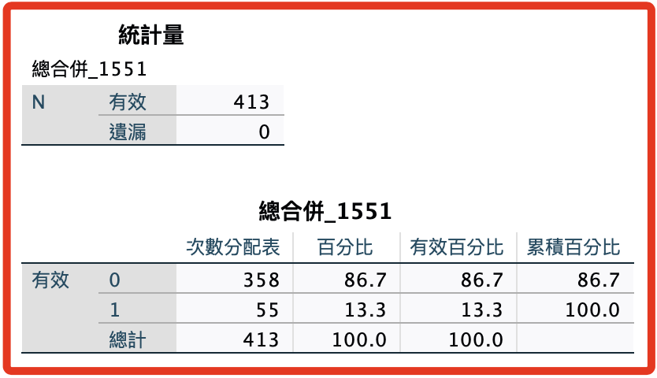

# 過濾與反轉 I

<br>

## 說明

1. 可透過反向題進行樣本有效性的檢討，至於是否刪除樣本需仔細評估。

2. 顯示狀態的第四個構面第（11、12、13）題是反向題，這部分（I）針對這個構面兩個水平進行處理。

3. 社會焦慮的第 08、10 兩題在下一部分（II）進行檢查。

4. 顯示狀態的第二個構面全部都是反向題，反轉即可（第 4、5、6、7 題）。

<br>

## 工作重點

_檢查 10-13 題_

<br>

1. 確認反向題的反轉已完成。

2. 分別檢查第（10）題與第（11~13）題的方向是否是完全反向，如（1-5）、（2-4）的組合，符合者予以刪除，

3. 檢查第（10）題與第（11~13）題的方向是否一致，透過計算差值總和，自訂閾值進行篩選。

4. 檢查第（11~13）題內部是否一致。

<br>

## 篩選之前先觀察一下數據

1. 確認無遺漏值、無「ELSE」項。

2. 可以合併為「Show01 TO Show18 Hide01 TO Hide18」。

3. 分開比較清楚。

<br>

## 觀察數據

1. 顯示點讚18題。

    ```bash
    *========================================.
    *次數分配＋長條圖.
    FREQUENCIES VARIABLES=Show01 TO Show18  
    /BARCHART FREQ
    /ORDER=ANALYSIS.
    *========================================.
    ```

<br>

2. 隱藏點讚18題。

    ```bash
    *========================================.
    *次數分配＋長條圖.
    FREQUENCIES VARIABLES=Hide01 TO Hide18 
    /BARCHART FREQ
    /ORDER=ANALYSIS.
    *========================================.
    ```

<br>

## 數據處理

_先對數據進行處理，然後對有反向題的構面進行內部一致性檢查，透過建立過濾器，觀察是否存在一致性的極端矛盾，例如同一構面的答案完極端相反；細部操作說明詳以下第一點，後續操作皆相同原則，不再贅述。_

<br>

1. 建立過濾器變數：對 `隱藏` 或 `顯示` 兩個群體分開編碼僅基於語法易讀性考量；過濾器的對照題顯示在第一個條件如 `Hide10` 或 `Show10`；變數名稱以 `Filter` 作為前綴， `H` 或 `S` 代表隱藏或顯示，第一個數值代表與對照組比較的題號，第二個數值代表對照題與比較題的答案，由於要篩選的是極值，所以這階段僅篩選 `1-5` 與 `5-1` 兩種。

    ```bash
    *========================================.
    * 建立過濾器變數，Hide10-Hide13 篩選條件為1-5、5-1.
    COMPUTE FilterH11_15 = (Hide10 = 1 AND Hide11 = 5).
    COMPUTE FilterH12_15 = (Hide10 = 1 AND Hide12 = 5).
    COMPUTE FilterH13_15 = (Hide10 = 1 AND Hide13 = 5).
    COMPUTE FilterH11_51 = (Hide10 = 5 AND Hide11 = 1).
    COMPUTE FilterH12_51 = (Hide10 = 5 AND Hide12 = 1).
    COMPUTE FilterH13_51 = (Hide10 = 5 AND Hide13 = 1).

    * 建立過濾器變數，Show10 -Show13 篩選條件為1-5、5-1.
    COMPUTE FilterS11_15 = (Show10 = 1 AND Show11 = 5).
    COMPUTE FilterS12_15 = (Show10 = 1 AND Show12 = 5).
    COMPUTE FilterS13_15 = (Show10 = 1 AND Show13 = 5).
    COMPUTE FilterS11_51 = (Show10 = 5 AND Show11 = 1).
    COMPUTE FilterS12_51 = (Show10 = 5 AND Show12 = 1).
    COMPUTE FilterS13_51 = (Show10 = 5 AND Show13 = 1).

    * 建立過濾器變數 H15、H51.
    COMPUTE FilterH15 = (FilterH11_15 = 1 OR FilterH12_15 = 1 OR FilterH13_15 = 1).
    COMPUTE FilterH51 = (FilterH11_51 = 1 OR FilterH12_51 = 1 OR FilterH13_51 = 1).

    * 建立過濾器變數 S15、S51.
    COMPUTE FilterS15 = (FilterS11_15 = 1 OR FilterS12_15 = 1 OR FilterS13_15 = 1).
    COMPUTE FilterS51 = (FilterS11_51 = 1 OR FilterS12_51 = 1 OR FilterS13_51 = 1).

    *合併 S15、S51.
    COMPUTE FilterS1551 = (FilterS15 = 1 OR FilterS51 = 1).

    *合併 H15、H51.
    COMPUTE FilterH1551 = (FilterH15 = 1 OR FilterH51 = 1).

    *合併：總合併.
    COMPUTE FilterHS1551 = (FilterH1551 = 1 OR FilterS1551 = 1).

    * 執行結果.
    EXECUTE.
    *========================================.
    ```

<br>

2. 加標籤。

    ```bash
    *========================================.
    *標籤名稱.
    VARIABLE LABELS FilterH11_15 '隱藏11_15'.
    VARIABLE LABELS FilterH12_15 '隱藏12_15'.
    VARIABLE LABELS FilterH13_15 '隱藏13_15'.
    VARIABLE LABELS FilterH11_51 '隱藏11_51'.
    VARIABLE LABELS FilterH12_51 '隱藏12_51'.
    VARIABLE LABELS FilterH13_51 '隱藏13_51'.
    VARIABLE LABELS FilterH15 '隱藏11-13_15'.
    VARIABLE LABELS FilterH51 '隱藏11-13_51'.
    VARIABLE LABELS FilterH1551 '隱藏11-13_1551'.

    VARIABLE LABELS FilterS11_15 '顯示11_15'.
    VARIABLE LABELS FilterS12_15 '顯示12_15'.
    VARIABLE LABELS FilterS13_15 '顯示13_15'.
    VARIABLE LABELS FilterS11_51 '顯示11_51'.
    VARIABLE LABELS FilterS12_51 '顯示12_51'.
    VARIABLE LABELS FilterS13_51 '顯示13_51'.
    VARIABLE LABELS FilterS15 '顯示11-13_15'.
    VARIABLE LABELS FilterS51 '顯示11-13_51'.
    VARIABLE LABELS FilterS1551 '顯示11-13_1551'.

    *合併：總合併.
    VARIABLE LABELS FilterHS1551 '總合併_1551'.

    *小數的位數為「0」，F 為 Format 的意思.
    FORMATS FilterH11_15 to FilterHS1551 (F1.0).

    *置中.
    VARIABLE ALIGN FilterH11_15 to FilterHS1551 (CENTER).

    * 執行結果.
    EXECUTE.
    *========================================.
    ```

<br>

## 觀察

1. 使用次數分配表及繪圖觀察 `隱藏的1-5、5-1：Hide10-13-1551` 與 `顯示的1-5、5-1：Show10-13-1551`。

    ```bash
    *========================================.
    * 次數分配表+繪圖.
    FREQUENCIES VARIABLES=
    FilterH11_15 FilterH12_15 FilterH13_15
    FilterH11_51 FilterH12_51 FilterH13_51
    FilterH15 FilterH51 FilterH1551
    FilterS11_15 FilterS12_15 FilterS13_15
    FilterS11_51 FilterS12_51 FilterS13_51
    FilterS15 FilterS51 FilterS1551
    /ORDER=ANALYSIS.

    * 執行結果.
    EXECUTE.
    *========================================.
    ```

<br>

2. 觀察：總效果。

    ```bash
    *========================================.
    * 次數分配表+繪圖.
    FREQUENCIES VARIABLES=
    FilterHS1551 
    /ORDER=ANALYSIS.

    * 執行結果.
    EXECUTE.
    *========================================.
    ```

<br>

3. 特別強調，以上的語法因分階段處理所以顯得龐大，若想 `簡化以上語法` 可以如下操作，但強烈不建議這樣做，因為這將導致無法觀察細節過程。

    ```bash
    *========================================.
    *使用一個指令建立篩選條件.
    COMPUTE FilterHS1551x = 
    (Hide10 = 1 AND (Hide11 = 5 OR Hide12 = 5 OR Hide13 = 5)) OR
    (Hide10 = 5 AND (Hide11 = 1 OR Hide12 = 1 OR Hide13 = 1)) OR
    (Show10 = 1 AND (Show11 = 5 OR Show12 = 5 OR Show13 = 5)) OR
    (Show10 = 5 AND (Show11 = 1 OR Show12 = 1 OR Show13 = 1))
    .
    * 執行結果.
    EXECUTE.
    *========================================.
    「觀察：總效果」
    *========================================.
    * 次數分配表+繪圖.
    FREQUENCIES VARIABLES=
    FilterHS1551x 
    /ORDER=ANALYSIS.

    * 執行結果.
    EXECUTE.
    *========================================.
    ```

<br>

4. 存檔：過濾器建立完成。

    ```bash
    *========================================.
    *儲存檔案.
    SAVE OUTFILE='/Users/samhsiao/Desktop/00_論文實作/v6_06_反向題建立過濾器.sav'.
    *========================================.
    ```

<br>

## 結果

1. 觀察。

    ```bash
    *========================================.
    FREQUENCIES VARIABLES=FilterHS1551 FilterHS1551x  
    /ORDER=ANALYSIS.
    *========================================.
    ```

<br>

2. 結果來說，若採用這個過濾器的話，樣本數還有（358）。

    

<br>

___

_END_
