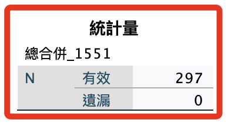
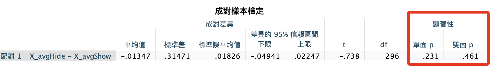
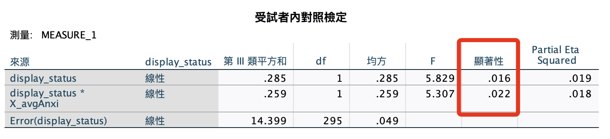
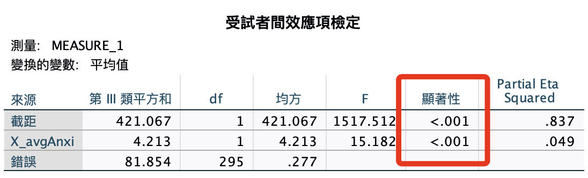

# 刪除樣本

_這裡僅做示範性的說明，並非一定要進行_

<br>

## 說明

1. 若要直接刪除，語法要使用  `SELECT IF`，以下這個條件 `FilterHS1551 = 0` 的意思是篩選出 `等於 0` 的樣本並保留，其他樣本會被刪除，而 `0` 所代表的就是判斷式中的 `FALSE`，也就是 `非極值樣本`。

    ```bash
    *========================================.
    * 設定篩選條件：刪除不滿足的資料.
    SELECT IF (FilterHS1551 = 0).
    EXECUTE.
    *========================================.
    ```

<br>

2. 觀察 `FilterHS1551` 的次數分配以確認刪除狀況。

    ```bash
    *========================================.
    * 次數分配表+繪圖.
    FREQUENCIES VARIABLES=
    FilterHS1551
    /ORDER=ANALYSIS.
    *========================================.
    ```

<br>

3. 結果：確認已完成刪除。

    

<br>

## 清理變數

1. 刪除篩選變數：注意，假如沒有 `x` 項，就去除尾綴 `x` 即可，因為再前面一個變數就是 `FilterHS1551`。

    ```bash
    *========================================.
    *刪除篩選變數.
    DELETE VARIABLES FilterH11_15 TO FilterHS1551x.
    EXECUTE.
    *========================================.
    ```

<br>

2. 檢驗測試：存檔之前嘗試觀察一下檢驗數據。

    ```bash
    *========================================.
    *計算變數：平均數.
    COMPUTE X_avgHide=MEAN(Hide01 TO Hide18).
    COMPUTE X_avgShow=MEAN(Show01 TO Show18).
    COMPUTE X_avgAnxi=MEAN(Ｑan01 TO Ｑan19).
    *執行.
    EXECUTE.

    *成對樣本T檢定.
    T-TEST PAIRS=X_avgHide WITH X_avgShow (PAIRED)
    /ES DISPLAY(TRUE) STANDARDIZER(SD)
    /CRITERIA=CI(.9500)
    /MISSING=ANALYSIS.

    *重複測量 ANOVA.
    GLM x_avgHide x_avgShow WITH x_avgAnxi
    /WSFACTOR=display_status 2 Polynomial 
    /METHOD=SSTYPE(3)
    /PRINT=DESCRIPTIVE ETASQ 
    /CRITERIA=ALPHA(.05)
    /WSDESIGN=display_status 
    /DESIGN=x_avgAnxi.

    *刪除原本變數.
    DELETE VARIABLES X_avgHide X_avgShow x_avgAnxi.

    *執行.
    EXECUTE.
    *========================================.
    ```

<br>

3. 結果。

    

    

    

<br>

## 存檔

1. 存檔：篩選變數完成。

    ```bash
    *========================================.
    *儲存檔案.
    SAVE OUTFILE='/Users/samhsiao/Desktop/00_論文實作/v01_07_反向題刪除樣本.sav'.
    *========================================.
    ```

<br>

___

_END_