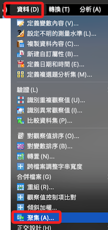
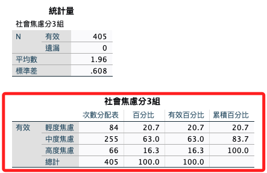
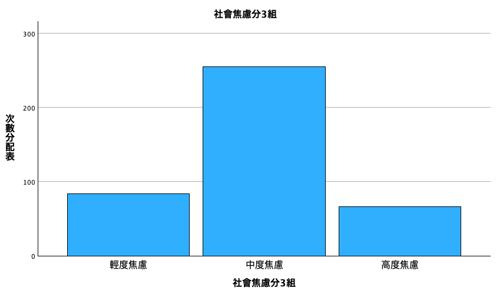
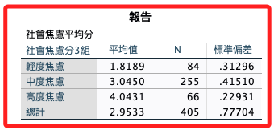

# 平均分數 I - 資料分組

<br>

## 說明

1. 對社交焦慮進行分組並無文獻支持，所以僅用於觀察資料所用，尤其在混合模型的事後檢定上，連續型的社交焦慮並不利於圖表的觀察與解讀。

2. 在上一個步驟計算了社交焦慮的平均分數，接下來對這個連續型資料進行分組，用以在後續步驟探討交互作用使用。

3. 分組並非等距分組，而是以中位數加減一個標準差作為分組的界線。

4. 依據統計學，在一個符合常態分配的數據中，平均數加減一個標準差所涵蓋的範圍是樣本的 68％。

<br>

## 面板操作

1. 使用面板的 `資料 -> 聚集（A）` 功能計算 `中位數` 與 `標準差` 可同時建立變數。

    

<br>

## 使用語法

1. 重新分組：社交焦慮。

    ```bash
    *========================================.
    *聚集：中位數、標準差.
    AGGREGATE
    /OUTFILE=* MODE=ADDVARIABLES
    /BREAK=
    /median_anx=Median(avgAnxi)
    /std_anx=SD(avgAnxi).

    *計算變數：創建分組變數.
    COMPUTE avgAnxi_G3 = (avgAnxi <= median_anx - std_anx) * 1 + (avgAnxi > median_anx - std_anx & avgAnxi < median_anx + std_anx) * 2 + (avgAnxi >= median_anx + std_anx) * 3.
    EXECUTE.

    *標籤名稱.
    VARIABLE LABELS avgAnxi_G3 '社會焦慮分3組'.

    *值標籤.
    VALUE LABELS avgAnxi_G3 
    1 '輕度焦慮'
    2 '中度焦慮'
    3 '高度焦慮'.

    *小數的寬度為「8」位數為「0」，F 為 Format 的意思.
    FORMATS avgAnxi_G3(F8.0).

    *變數類型為序數.
    VARIABLE LEVEL avgAnxi_G3(ORDINAL).

    *置中 CENTER.
    VARIABLE ALIGN avgAnxi_G3(CENTER).

    *刪除變數.
    DELETE VARIABLES median_anx std_anx.
    EXECUTE.
    *========================================.
    ```

<br>

2. 排序變數。

    ```bash
    *========================================.
    *排序變數.
    MATCH FILES FILE = *
    /KEEP = 
    UID sex age isKnowHideFunction useYears useFrequency useTime 
    avgAnxi avgHide avgShow avgAnxi_G3 
    Ｑan01 Ｑan02 Ｑan03 Ｑan04 Ｑan05 Ｑan06 Ｑan07 Ｑan08 
    Ｑan09 Ｑan10 Ｑan11 Ｑan12 Ｑan13 Ｑan14 Ｑan15 Ｑan16 
    Ｑan17 Ｑan18 Ｑan19 
    Hide01 Hide02 Hide03 Hide04 Hide05 Hide06 Hide07 
    Hide08 Hide09 
    Hide11 Hide12 Hide13 Hide14 
    Hide15 Hide16 Hide17 Hide18 
    Show01 Show02 Show03 Show04 Show05 Show06 Show07 
    Show08 Show09 
    Show11 Show12 Show13 Show14 
    Show15 Show16 Show17 Show18.
    EXECUTE.
    *========================================.
    ```


    3. 存檔：社交焦慮分組。

    ```bash
    *========================================.
    *儲存檔案.
    SAVE OUTFILE='/Users/samhsiao/Desktop/02_論文_清心/00_論文數據/v6_11_社交焦慮分組.sav'.
    *========================================.
    ```

<br>

## 報表

1. 次數分配。

    ```bash
    *========================================.
    *觀察次數.
    FREQUENCIES VARIABLES=avgAnxi_G3
    /STATISTICS=STDDEV MEAN
    /BARCHART FREQ
    /ORDER=ANALYSIS.
    *========================================.
    ```

    _輸出_

    

<br>

2. 長條圖。

    

<br>

3. 另外也可以觀察三組的平均數與標準差。

    ```bash
    *========================================.
    *報告.
    MEANS TABLES=avgAnxi BY avgAnxi_G3
    /CELLS MEAN COUNT STDDEV.
    *========================================.
    ```

    _輸出_

    

<br>

___

_END_