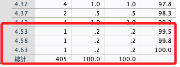

# 平均分數 I 刪樣本

<br>

## 說明

1. 因為後續的項目如差分項會依據平均分數計算，所以若有刪除其極端樣本的必要，必須在計算完成之後先進行。

<br>

2. 所以這裡要先做各種檢定再往下走，切記若有變動到樣本，需回到前一個「信度分析」開始重來一次，這是一個迭代的過程。

<br>

## 次數分配＋繪圖

_觀察三個平均數_

<br>

1. 連續資料使用直方圖+常態曲線。

    ```bash
    *========================================.
    *次數分配＋繪圖：三個平均數.
    FREQUENCIES VARIABLES=avgAnxi avgHide avgShow
    /HISTOGRAM NORMAL
    /ORDER=ANALYSIS.
    EXECUTE.
    *========================================.
    ```

<br>

## 報表

1. 確認一下統計量。

    

<br>

2. 觀察兩側極端值的次數分配。

    

<br>

3. 另一邊的極值。

    

<br>

4. 查看三個直方圖。

    

<br>

5. 預檢資料。

    ```bash
    *========================================.
    *預檢資料：三個平均數.
    EXAMINE VARIABLES=avgAnxi avgHide avgShow
    /PLOT BOXPLOT NPPLOT
    /COMPARE GROUPS
    /STATISTICS DESCRIPTIVES
    /CINTERVAL 95
    /MISSING LISTWISE
    /NOTOTAL.
    *========================================.
    ```

<br>

6. 結果：raw data 並未通過常態檢定，這之後再處理。

    

<br>

## 觀察 Q-Q 圖

1. 社交焦慮。

    

<br>

2. 隱藏點讚。

    

<br>

3. 顯示點讚。 

    

<br>

## 討論

_這裡出現不遵從常態分配的檢驗結果，接下來可以有幾個路徑可以進行。_

<br>

1. 第一個方案：宣告基於中央極限定理的理論支持，本實驗樣本數約略400符合大樣本實驗，雖部分樣本統計量不遵從常態分佈，依舊可適用參數統計方法，包含了 T 檢定以及 ANOVA。

<br>

2. 第二個方案：基於第一個方案的相同支持，在接下來的驗證過程中，對於原生數據以及模型擬合後的數據皆採用參數統計方法，但逐項皆以非參數統計方法進行輔助說明，確保參數與非參數統計方法的結論一致性，但要特別注意，推論時將以參數統計方法為基準，非參數統計的結論僅作為參數統計方法的參考輔助。

<br>

3. 第三個方案：在接下來的驗證與推論中，採用一致性的標準，對於逐項不符合常態檢驗標準的數據，皆採用非參數統計方法，切記，統計分析標準的一致性是嚴謹度表現的基本要求，所以若要選用非參數統計方法，則需維持該標準進行後續步驟。

<br>

___

_END_