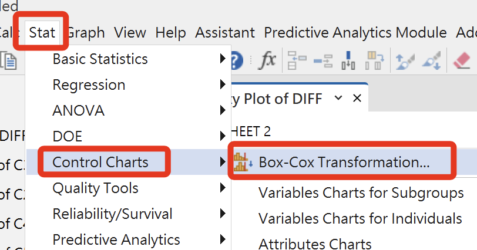
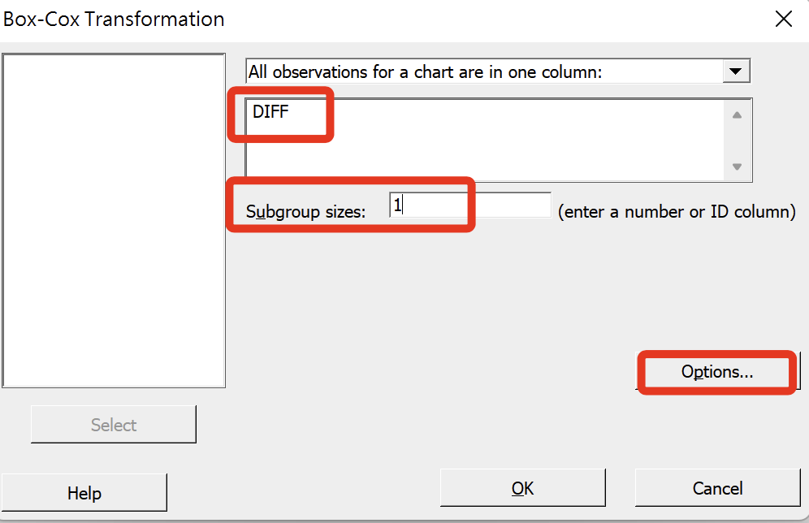

# Minitab

<br>

## 說明

_這裡是說明假如要使用 Minitab 進行數據轉換以及常態檢定的步驟，先跳過。_

<br>

1. 在 SPSS 中複製差分項。

    

<br>

2. 開啟一個 EXCEL 檔案並貼上。

    

<br>

3. 變數名稱不會複製，所以插入一行（row）給變數命名。

    

<br>

4. 自訂一個名稱。

    

<br>

5. 然後選取這個列（欄位），可全選後複製。

    

<br>

6. 開啟「Minitab」後，在下方的表單中貼上。

    

<br>

7. 會包含變數名稱都貼上。

    

<br>

## 開啟 `Minitab`

1. 可先進行一次常態檢定：`統計 -> 基本統計 -> 常態檢定`。

    

<br>

2. 設定。

    

<br>

3. 報表會顯示是否符合。

    

<br>

## 進行 `Box-Cox`

1. `統計 -> 控制圖表 -> BOX-COX`。

    

<br>

2. 選取變數後先進行設定

    

<br>

3. 先選擇最佳化 lambda 值，並設定輸出欄位 -> OK

    

<br>

4. 然後再 OK 一次

    

<br>

5. 下方會在指定欄位「C2」顯示 BOX-COX 報表，可自訂名稱（選）。

    

<br>

## 分析

1. 當範圍包含「0」，會自動計算出最佳解；若不包含「0」，需手動在選項中輸入。

    

<br>

2. 對於 `lambda = -1`。

    ```bash
    *========================================.
    * 對於 lambda = -1.
    COMPUTE BC_m1 = (diffHideShow ** -1 - 1) / -1.
    EXECUTE.
    *========================================.
    ```

<br>

3. 對於 `lambda = 1`。

    ```bash
    *========================================.
    * 對於 lambda = 1.
    COMPUTE BC_1 = (diffHideShow ** 1 - 1) / 1.
    EXECUTE.
    *========================================.
    ```

<br>

___

_END_
