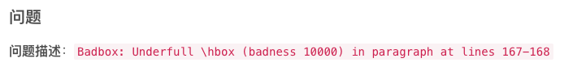

# 錯誤排除紀錄

 

## 關於

 

1. [參考](https://blog.csdn.net/qq_39560620/article/details/105373426)

 

2. 說明：

    1) 將段落中的\\去掉； 

    2) 若要進行換行，使用\newline； 

    3) 若要添加空行，可使用\bigskip、\medskip、\smallskip和\vspace{<len>}，

    4) 其中<len>為自行定義的高度。

 

___

_END_